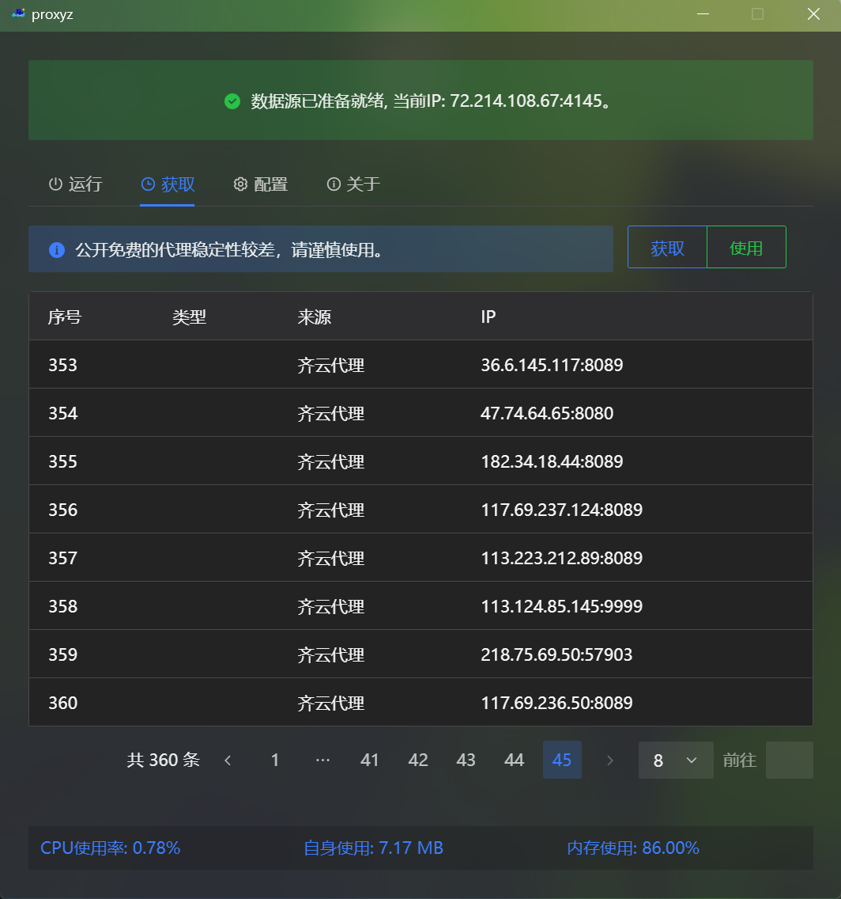

# Proxyz

> 一个用于动态切换ip的代理池工具，界面友好上手简单

## 使用
自行导入文件，经检测后若存在可用代理则会持续监听本地的`127.0.0.1:1080`, 相关参数配置可自行修改。 使用预览如下：

除了自行指定文件以外，还可以爬取免费代理但安全和稳定不能保证（还有问题）

## TODO
- [ ] 获取部分添加更多免费socks代理的获取
- [ ] 配置变动后前端刷新以及配置的保存
- [ ] ...

## 免责声明
本工具（proxyz）仅供学习、研究和合法授权测试使用。开发者不对因使用、误用或依赖本工具而导致的任何直接或间接损失、损害或法律责任负责。使用者需自行承担使用本工具的风险，并确保其行为符合当地法律法规。

在使用本工具之前，请务必了解并遵守以下事项：

    1.合法用途：仅将本工具用于合法授权的测试环境或您拥有明确权限的系统。未经授权的使用可能违反法律。

    2.风险自担：本工具按“原样”提供，不提供任何形式的明示或暗示的担保，包括但不限于适用性、可靠性或安全性。

    3.责任限制：开发者不对因使用本工具导致的任何数据丢失、系统损坏、法律责任或其他后果负责。

    4.遵守法律：使用者需确保其行为符合所在国家或地区的法律法规。开发者不对任何非法使用行为负责。

如果您使用本工具，即表示您已阅读、理解并同意本免责声明的所有条款。