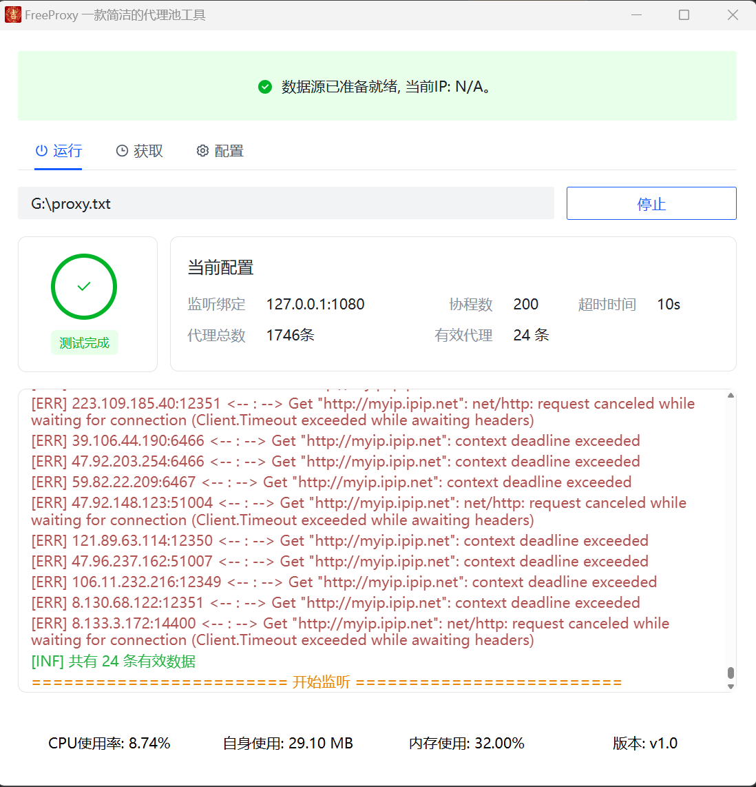
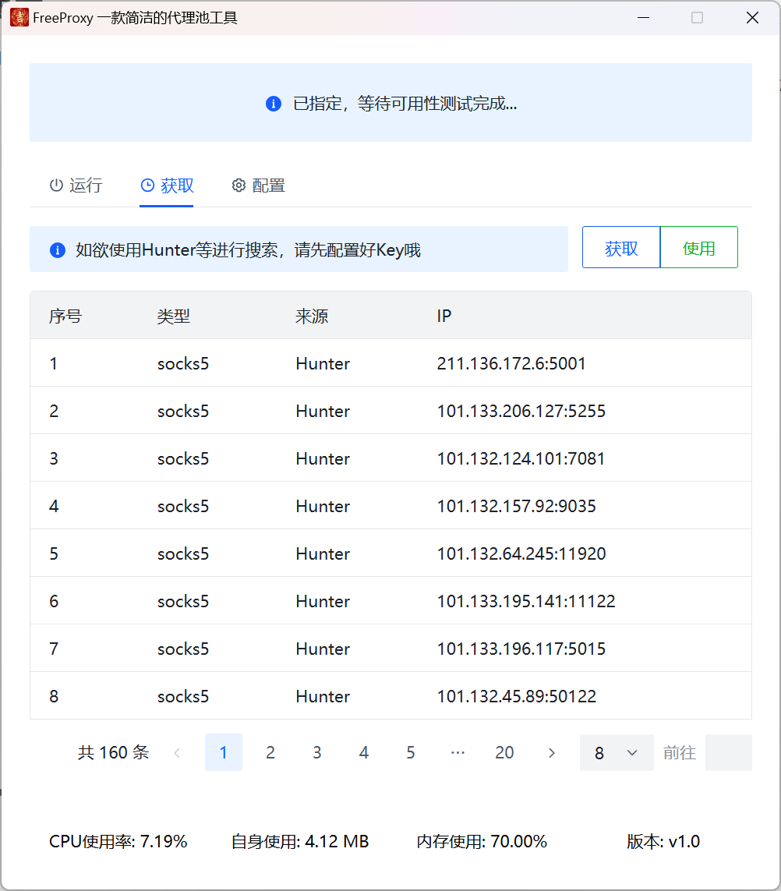
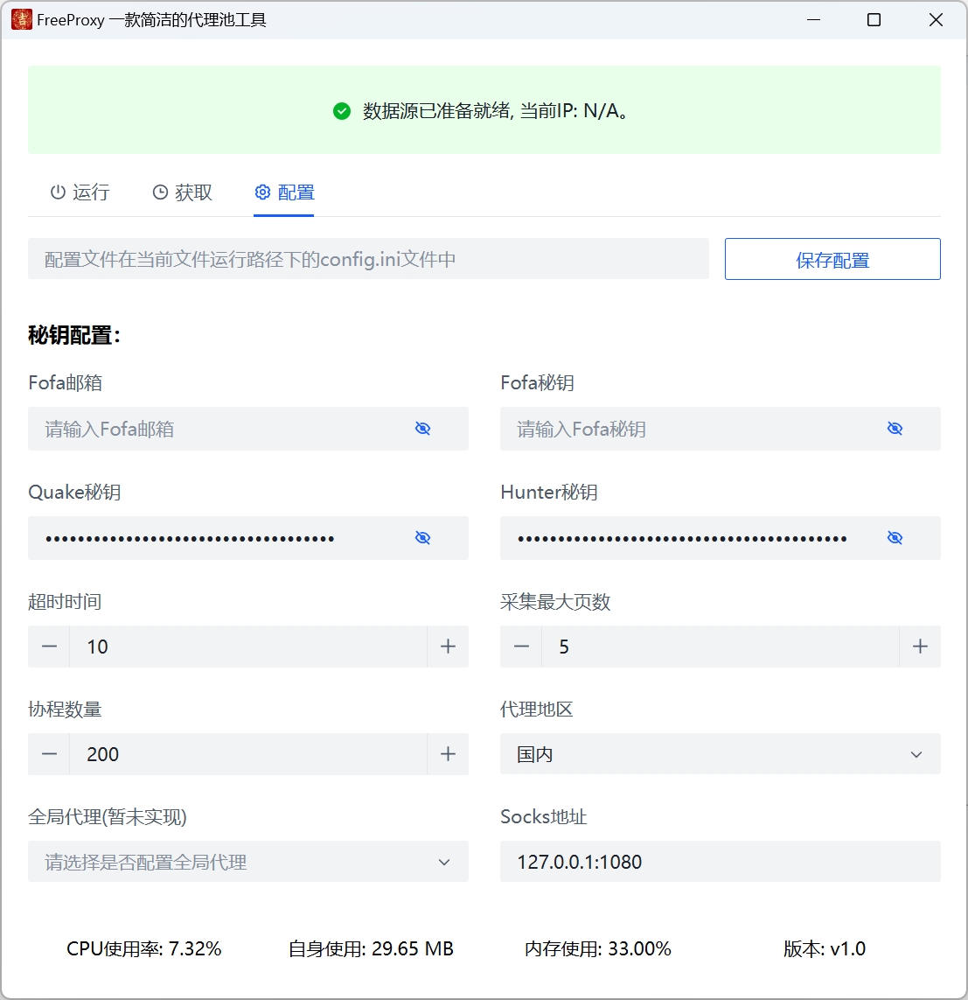
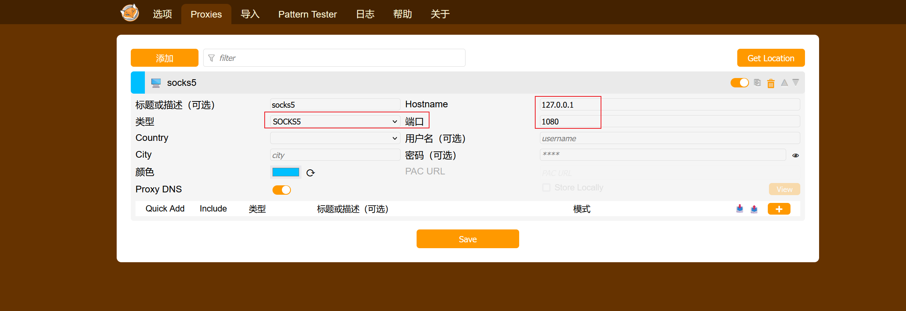
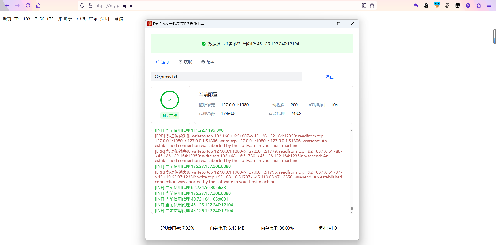

# FreeProxy

> 一个用于动态切换ip的代理池工具，本工具参考自https://github.com/BKLockly/Proxyz
>
> 参考原作者前端界面（主要是鄙人不会前端o(╥﹏╥)o），新增搜索引擎获取、修复存在的bug
>
> 感谢原作者写出这么好看的前端

## 程序使用
1. 自行导入文件，经检测后若存在可用代理则会持续监听本地的`127.0.0.1:1080`

+ 参考其他师傅搜索引擎语法，目前适配获取fofa、hunter、quake平台数据。

+ 配置保存

## 代理配置

以火狐浏览器为例，下载FoxyProxy，点击添加，选择socks5协议

插件选择刚刚配置的代理即可

## 注意事项

+ mac下采集保存的代理文件在包结构中，需要手动访问，后续将完善
+ 系统全局配置暂未实现，后续将添加
+ 如果配置采集页面较多，请耐心等待
